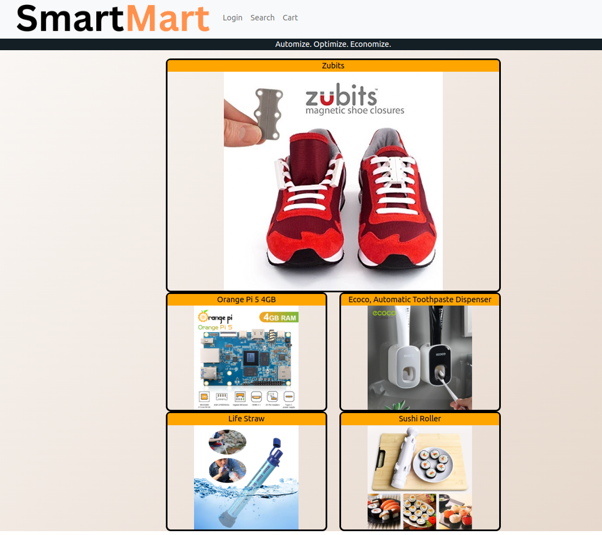

# Smart-Mart-Frontend

<b>
👔GET👔SMART👔
</b>

Welcome to the frontend repo for my project: Smart Mart, the one stop shop for all things smart. 🔧

The frontend is made with: React, React-Bootstrap, Redux, SASS and hosted on Aws Amplify!

To check out in production, use the following link to the AWS front end -> (link will go here, am not putting it yet just in case someone brute forces my railway instance out of credits)

If you would like to see the back end for this project, please direct yourself to the following repository -> https://github.com/gmluqa/Smart-Mart-Backend

# Set-up for local development

Clone this repo: `git clone https://github.com/gmluqa/Smart-Mart-Backend.git`

Switch to the develop branch `git switch develop`.

Populate node_modules `npm i`

run `npm run dev` to spin up the development front-end on localhost

# Credits

- I no longer hate redux, just a little bit (it's all love ❤️, will use redux more confidently from now on).
- Should've designed every single view in a figma and had what I was designing towards in mind, layout was improvised if I'm to be honest, will use this design pattern in all my projects from now on 🌈.
- Learned to fix react warnings AS SOON AS THEY COME IN, saves SO MUCH headache 😡.
